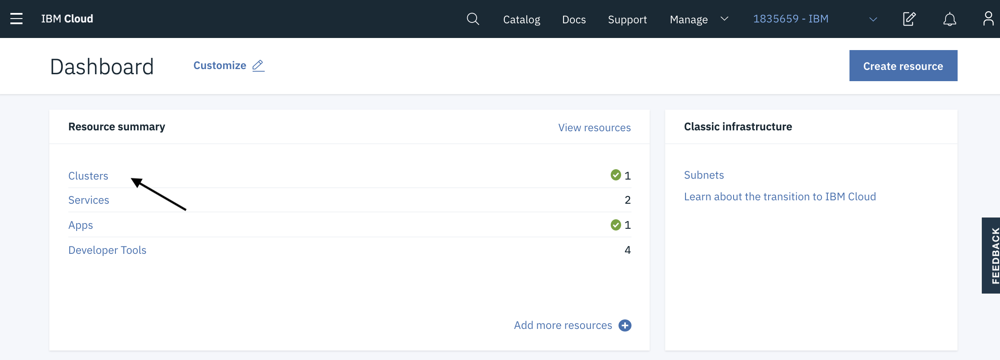
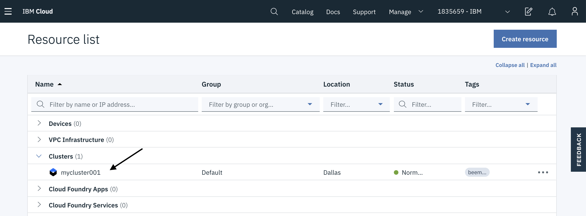

>**Getting Started - Prepare Your Environment** # 
[Exercise 1 - Accessing your Kubernetes Cluster](exercise-1/README.md) #
[Exercise 2 - Installing Istio](exercise-2/README.md) # 
[Exercise 3 - Deploy Guestbook with Istio Proxy](exercise-3/README.md) # 
[Exercise 4 - Telemetry](exercise-4/README.md) # 
[Exercise 5 - Expose the service mesh with the Istio Ingress Gateway](exercise-5/README.md) # 
[Exercise 6 - Traffic Management](exercise-6/README.md) # 
[Exercise 7 - Security](exercise-7/README.md)

---

# Getting Started

## WiFi

**SSID:**  xxxxxx
**Password:** YYYYYY

## Lab Key

Will be written on the whiteboard

## Prepare Your Environment

In this section, you will login to your own IBM Cloud account, and then get access to an IBM Cloud Lab account which contains pre-provisioned Kubernetes clusters. Each lab attendee will be granted access to one cluster.

1. Create your own [IBM Cloud account](https://ibm.biz/BdqcXN)   

1. After the email verification, confirm by logging in to https://cloud.ibm.com.

1. Go to [Grant Cluster](https://kubeforumsydney.mybluemix.net/) web page and enter your IBM ID (the email you used to sign up) and the lab key from the instructor

    

1. You will be added to the IBM Lab account and granted access to a cluster. Note the name of your cluster. It will be something like: `myclusterXXX`.

1. Refresh your [IBM Cloud Dashboard](https://cloud.ibm.com)

1. Switch to the **1835659-IBM** account by clicking on the account selection drop down in the top nav bar.

   

1. Click on **Clusters** in the Resource Summary tile.

    

1.  Under **Clusters**, click on the cluster that has been assigned to you.

    

1. Launch the **Kubernetes Dashboard** and have a look around! You can come back to this dashboard throughout your lab.

10. On your own workstation/laptop/notebook create a text file (call it 'environment.txt' if you need an idea for a name) and save the cluster name. Keep this file open throughout the lab to store other important values and parameters.

    You can use this as a template for your own `environment.txt`:

    ```
    Access the K8s cluster:
    export MYCLUSTER=
    ibmcloud ks cluster config $MYCLUSTER
    export KUBECONFIG=

    Get the Workshop code:
    git clone https://github.com/IBM/istio101
    cd istio101/workshop
    git clone -b kubecon2019 https://github.com/IBM/guestbook
    cd guestbook/v2

    Tone Analyzer (you may need to change istio101/workshop/guestbook/v2/analyzer-deployment.yaml again)
    apikey: 
    url:    
    ```


### [Continue to Exercise 1](/workshop/exercise-1/README.md)

