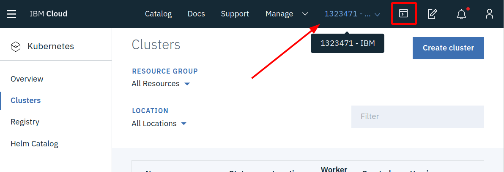

[Getting Started - Prepare Your Environment](../README.md) ## 
**Exercise 1 - Accessing your Kubernetes Cluster** ## 
[Exercise 2 - Installing Istio](exercise-2/README.md) ## 
[Exercise 3 - Deploy Guestbook with Istio Proxy](exercise-3/README.md) ## 
[Exercise 4 - Expose the service mesh with the Istio Ingress Gateway](exercise-4/README.md) ## 
[Exercise 5 - Telemetry](exercise-5/README.md) ## 
[Exercise 6 - Traffic Management](exercise-6/README.md) ## 
[Exercise 7 - Security](exercise-7/README.md)

---

# Exercise 1 - Accessing your Kubernetes Cluster

You must already have an IBM account, with a cluster created or assigned to you as documented in the [previous step](../README.md).

## Connect to your cluster using the IBM Cloud Shell 

For this lab, a Cloud Shell is provided for you with all the necessary tools. Use this web-based shell to perform the tasks in this lab. 

1. Using Chrome or Firefox, [**click here to launch Cloud Shell**](https://workshop.shell.cloud.ibm.com/) and `Login` with your IBM Cloud account.

    Note: If prompted for a password or passphrase, use `ikslab`.

1. Using the account drop down, choose the **IBM** account.

   
   
1. Click on the Terminal icon to launch your cloud shell.

**Note:** The IBM Cloud Shell has an **inactivity timeout** (somewhere around 10 to 15 minutes). The connection to Cloud Shell is closed once this timeout is reached. Simply close the Terminal tab (x) and create a new one (+). The content of the home directory including the cloned repositories should (!) still be there (data stored in '/home/xxxx' will be persisted but I have seen it gone on occasion) but the environment variables set throughout the lab will be gone. That is why at certain points throughout this lab we tell you to save them in the external environment.txt file (created at the end of the Getting Started) so that you can easily recreate your environment.

## Access your cluster
Learn how to set the context to work with your cluster by using the `kubectl` CLI, access the Kubernetes dashboard, and gather basic information about your cluster.

1.  Set the context for your cluster in your CLI. Every time you log in to the IBM Cloud Kubernetes Service CLI to work with the cluster, you must run these commands to set the path to the cluster's configuration file as a session variable. The Kubernetes CLI uses this variable to find a local configuration file and certificates that are necessary to connect with the cluster in IBM Cloud.

    a. List the available clusters. You should see the cluster you were assigned.

    ```shell
    ibmcloud ks clusters
    ```

    b. Set an environment variable for your cluster name:

    ```shell
    export MYCLUSTER=<your_cluster_name>
    ```

    **Copy this 'export' command to your environment file.** 

    c. Download the configuration file and certificates for your cluster using the `cluster config` command.

    ```shell
    ibmcloud ks cluster config $MYCLUSTER
    ```

    c. *Copy and paste the output export command* from the output of previous step and save it in your environment file, too. This will set the `KUBECONFIG` environment variable and configure your `kubectl` CLI to run commands against your cluster. Example:
    `export KUBECONFIG=/Users...`

2.  Get basic information about your cluster and its worker nodes. This information can help you manage your cluster and troubleshoot issues.

    a.  View details of your cluster.

    ```shell
    ibmcloud ks cluster get $MYCLUSTER
    ```

    b.  Verify the worker nodes in the cluster.

    ```shell
    ibmcloud ks workers $MYCLUSTER
    ibmcloud ks worker get <worker_ID>
    ```

3.  Validate access to your cluster.

    a.  View nodes in the cluster.

    ```shell
    kubectl get node
    ```

    b.  View services, deployments, and pods.

    ```shell
    kubectl get svc,deploy,po --all-namespaces
    ```

## Clone the lab repo

From your command line, run:

```
git clone https://github.com/Harald-U/istio101.git
cd istio101/workshop/guestbook/v2
```

This is the working directory for the workshop. You will use the `.yaml` files that are located in the `workshop/plans` directory in the following exercises.

---

### [Continue to Exercise 2 - Installing Istio](../exercise-2/README.md)
