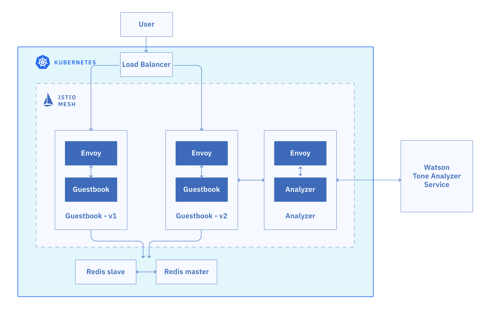
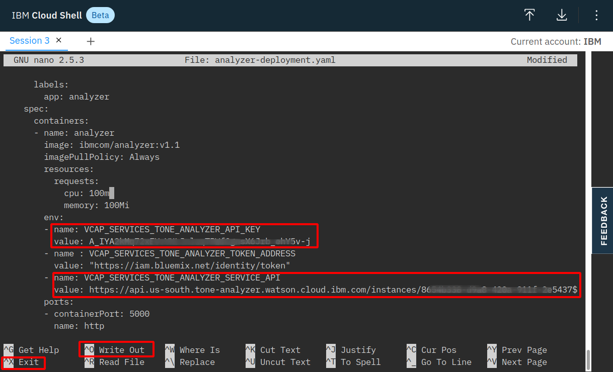

>[Getting Started - Prepare Your Environment](../README.md) ## 
[Exercise 1 - Accessing your Kubernetes Cluster](../exercise-1/README.md) ## 
[Exercise 2 - Installing Istio](../exercise-2/README.md) ## 
**Exercise 3 - Deploy Guestbook with Istio Proxy** ## 
[Exercise 4 - Expose the service mesh with the Istio Ingress Gateway](exercise-4/README.md) ## 
[Exercise 5 - Telemetry](exercise-5/README.md) ## 
[Exercise 6 - Traffic Management](exercise-6/README.md) ## 
[Exercise 7 - Security](exercise-7/README.md)

---

# Exercise 3 - Deploy the Guestbook app with Istio Proxy

The Guestbook app is a sample app for users to leave comments. It consists of a web front end, Redis master for storage, and a replicated set of Redis slaves. We will also integrate the app with Watson Tone Analyzer which detects the sentiment in users' comments and replies with emoticons.



<!-- ### Download the Guestbook app
1. In the web shell, clone the Guestbook app from GitHub into the `workshop` directory.

    ```shell
    git clone -b kubecon2019 https://github.com/IBM/guestbook
    ```

2. Navigate into the app directory.

    ```shell
    cd guestbook/v2
    ```
-->

### Enable the automatic sidecar injection for the default namespace
In Kubernetes, a sidecar is a utility container in the pod, and its purpose is to support the main container. For Istio to work, Envoy proxies must be deployed as sidecars to each pod of the deployment. There are two ways of injecting the Istio sidecar into a pod: manually using the istioctl CLI tool or automatically using the Istio sidecar injector. In this exercise, we will use the automatic sidecar injection provided by Istio which is enabled by adding a label to a namespace.

1. Annotate the default namespace to enable automatic sidecar injection:
    
    ``` shell
    kubectl label namespace default istio-injection=enabled
    ```
    
2. Validate the namespace is annotated for automatic sidecar injection:
    
    ``` shell
    kubectl get namespace -L istio-injection
    ```
    
    Sample output:
    ``` shell
    NAME             STATUS   AGE    ISTIO-INJECTION
    default          Active   271d   enabled
    istio-system     Active   5d2h
    ...
    ```

### Create a Redis database
The Redis database is a service that you can use to persist the data of your app. The Redis database comes with a master and slave modules.

1. Create the Redis controllers and services for both the master and the slave.

    ``` shell
    kubectl create -f redis-master-deployment.yaml
    kubectl create -f redis-master-service.yaml
    kubectl create -f redis-slave-deployment.yaml
    kubectl create -f redis-slave-service.yaml
    ```

2. Verify that the Redis controllers for the master and the slave are created.

    ```shell
    kubectl get deployment
    ```
    Output:
    ```shell
    NAME           READY   UP-TO-DATE   AVAILABLE   AGE
    redis-master   1/1     1            1           26s
    redis-slave    2/2     2            2           21s
    ```

3. Verify that the Redis services for the master and the slave are created.

    ```shell
    kubectl get svc | grep redis
    ```
    Output:
    ```shell
    NAME           TYPE           CLUSTER-IP      EXTERNAL-IP     PORT(S)        AGE
    redis-master   ClusterIP      172.21.85.39    <none>          6379/TCP       5d
    redis-slave    ClusterIP      172.21.205.35   <none>          6379/TCP       5d
    ```

4. Verify that the Redis pods for the master and the slave are up and running.

    ```shell
    kubectl get pods
    ```
    Output:
    ```shell
    NAME                            READY     STATUS    RESTARTS   AGE
    redis-master-4sswq              2/2       Running   0          5d
    redis-slave-kj8jp               2/2       Running   0          5d
    redis-slave-nslps               2/2       Running   0          5d
    ```

## Install the Guestbook app

1. Inject the Istio Envoy sidecar into the guestbook pods, and deploy the Guestbook app on to the Kubernetes cluster. Deploy both the v1 and v2 versions of the app:

    ```shell
    kubectl apply -f ../v1/guestbook-deployment.yaml
    kubectl apply -f guestbook-deployment.yaml
    ```

    These commands deploy the Guestbook app on to the Kubernetes cluster. Since we enabled automation sidecar injection, these pods will also include an Envoy sidecar as they are started in the cluster. Here we have two versions of deployments, a new version (`v2`) in the current directory, and a previous version (`v1`) in a sibling directory. They will be used in future sections to showcase the Istio traffic routing capabilities.

1. Verify that the pods are up and running.

    ```shell
    kubectl get pods | grep guestbook
    ```
    Sample output:
    ```shell
    NAME                            READY     STATUS    RESTARTS   AGE
    guestbook-v1-89cd4b7c7-frscs    2/2       Running   0          5d
    guestbook-v2-56d98b558c-mzbxk   2/2       Running   0          5d
    ```

    Note that each guestbook pod has 2 containers in it. One is the guestbook container, and the other is the Envoy proxy sidecar.

1. Create the guestbook service.

    ```shell
    kubectl create -f guestbook-service.yaml
    ```

1. Verify that the service was created.

    ```shell
    kubectl get svc 
    ```
    Output:
    ```shell
    NAME           TYPE           CLUSTER-IP       EXTERNAL-IP    PORT(S)        AGE
    guestbook      LoadBalancer   172.21.1.122     141.125.94.3   80:31710/TCP   93s
    kubernetes     ClusterIP      172.21.0.1       <none>         443/TCP        7h6m
    redis-master   ClusterIP      172.21.210.97    <none>         6379/TCP       2m46s
    redis-slave    ClusterIP      172.21.186.161   <none>         6379/TCP       2m41s
    ```

1. Open the EXTERNAL-IP of the guestbook service in your browser. You should see the Guestbook app.

### Use Watson Tone Analyzer
Watson Tone Analyzer detects the tone from the words that users enter into the Guestbook app (version 2). The tone is converted to the corresponding emoticons.

Create Watson Tone Analyzer in your own account.

1. Switch to **your own account** by logging in again.

    ```shell
    ibmcloud login
    ```

1. From the account list, choose your own account (not the IBM account)!

1. If prompted to choose a region, select us-south.

1. Create Watson Tone Analyzer service in the `default` resource group. 

    ```shell
    ibmcloud resource service-instance-create my-tone-analyzer-service tone-analyzer lite us-south -g default
    ```

    > If the previous command errors ("No resource group found"), try '-g Default' rather than '-g default'.
    
    > See all resource groups by running `ibmcloud resource groups`. If it fails due to the region, try `eu-de` rather than `us-south`.

1. Create the service key for the Tone Analyzer service. This command should output the credentials you just created. You will need the value for **apikey** & **url** later. Save them in your environment file, too!

    ```shell
    ibmcloud resource service-key-create tone-analyzer-key Manager --instance-name my-tone-analyzer-service
    ```
1. If you need to get the service-keys later, you can use the following command:

    ```shell
    ibmcloud resource service-key tone-analyzer-key
    ``` 

1. Open `istio101/workshop/guestbook/v2/analyzer-deployment.yaml` in an editor (nano or vi):

   ```
   nano analyzer-deployment.yaml
   ```
   
   


1. Find the env section near the end of the file (use cursor keys to navigate!). Replace YOUR_API_KEY with the **apikey** and YOUR_URL with the **url**, both provided earlier. With nano, save the file (Ctrl-o) and close the editor (Ctrl-x).


1.   Deploy the analyzer pods and service, using the `analyzer-deployment.yaml` and `analyzer-service.yaml` files. The analyzer service talks to Watson Tone Analyzer to help analyze the tone of a message. Ensure you are still in the `guestbook/v2` directory.

      ```
      kubectl apply -f analyzer-deployment.yaml
      kubectl apply -f analyzer-service.yaml
      ```

Great! Your guestbook app is up and running. In Exercise 4, you'll be able to see the app in action.

---

### [Continue to Exercise 4 - Expose the service mesh with the Istio Ingress Gateway](../exercise-4/README.md)
