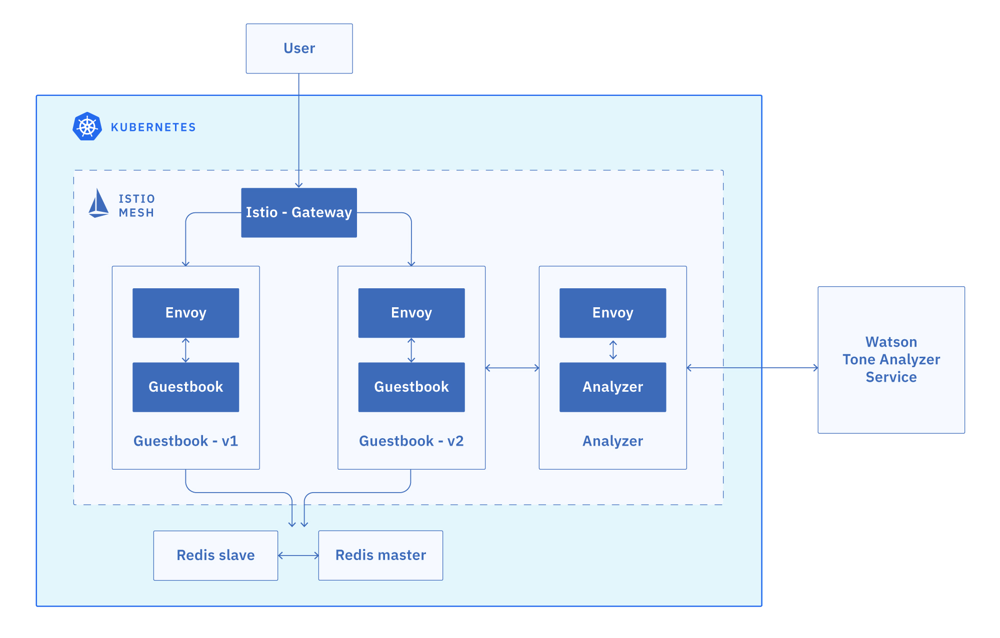

>[Getting Started - Prepare Your Environment](../README.md) ## 
[Exercise 1 - Accessing your Kubernetes Cluster](../exercise-1/README.md) ##
[Exercise 2 - Installing Istio](../exercise-2/README.md) ## 
[Exercise 3 - Deploy Guestbook with Istio Proxy](../exercise-3/README.md) ## 
**Exercise 4 - Expose the service mesh with the Istio Ingress Gateway** ## 
[Exercise 5 - Telemetry](../exercise-5/README.md) ## 
[Exercise 6 - Traffic Management](../exercise-6/README.md) ## 
[Exercise 7 - Security](../exercise-7/README.md)

---

# Exercise 4 - Expose the service mesh with the Istio Ingress Gateway

<!-- **Note:** You will be able to complete this exercise on the Kubernetes clusters provided to you for this workshop. You will **not be able** to do this on a lite Kubernetes cluster on IBM Cloud since the free lite clusters do not have external IP adresses and Network Load Balancers (NLBs) available. -->

The components deployed on the service mesh by default are not exposed outside the cluster. External access to individual services so far has been provided by creating an external load balancer or node port on each service.

An Ingress Gateway resource can be created to allow external requests through the Istio Ingress Gateway to the backing services.



### Expose the Guestbook app with Ingress Gateway

1. Configure the guestbook default route with the Istio Ingress Gateway. The `guestbook-gateway.yaml` file is in this repository (istio101) in the `workshop/plans` directory.

    ```shell
    cd ../../plans
    kubectl create -f guestbook-gateway.yaml
    ```

2. Get the **EXTERNAL-IP** of the Istio Ingress Gateway.

    ```shell
    kubectl get service istio-ingressgateway -n istio-system
    ```
    Output:
    ```shell
    NAME                   TYPE           CLUSTER-IP      EXTERNAL-IP     PORT(S)                                       AGE
    istio-ingressgateway   LoadBalancer   172.21.254.53    169.6.1.1       80:31380/TCP,443:31390/TCP,31400:31400/TCP    1m
    2d
    ```

3. Make note of the external IP address that you retrieved in the previous step, as it will be used to access the Guestbook app in later parts of the course. Create an environment variable called $INGRESS_IP with your IP address.

    Example:
    ```
    export INGRESS_IP=169.6.1.1
    ```

## Connect Istio Ingress Gateway to the IBM Cloud Kubernetes Service NLB Host Name

NLB host names are the DNS host names you can generate for each IBM Cloud Kubernetes deployment exposed with the Network LoadBalancer(NLB) service. These host names come with SSL certificate, the DNS registration, and health checks so you can benefit from them for any deployments that you expose via the NLB on IBM Cloud Kubernetes Service.

For example, you can run the IBM Cloud Kubernetes Service ALB, an API gateway of your choice, an Istio ingress gateway, and an MQTT server in parallel in your IBM Cloud Kubernetes Service cluster. Each one will have its own:

- Publicly available wildcard host name
- Wildcard SSL certificate associated with the host name
- Health checks that you can configure if you use multizone deployments. 
    
Let's leverage this feature with Istio ingress gateway:


1. Switch back the `ibmcloud` CLI to the **IBM** Lab account by logging in again:

    ```shell
    ibmcloud login
    ```

1. From the account list, choose IBM as the Account (NOT your own)

1. Create the NLB host with the Istio ingress gateway's public IP address:

    ```shell
    ibmcloud ks nlb-dns create classic --cluster $MYCLUSTER --ip $INGRESS_IP
    ```

1. List the NLB host names for your cluster:

    ```shell
    ibmcloud ks nlb-dns ls --cluster $MYCLUSTER
    ```

    Example output:
    ```
   
    Hostname                                                                                IP             Health Monitor   H.Monitor Status   
    istio1010bin09-0e3e0ef4c9c6d831e8aa6fe01f33bfc4-0000.eu-gb.containers.appdomain.cloud   141.125.94.2   None             created           istio1010bin09-0e3e0ef4c9c6d831e8aa6fe01f33bfc4-0000   default   
    istio1010bin09-0e3e0ef4c9c6d831e8aa6fe01f33bfc4-0001.eu-gb.containers.appdomain.cloud   141.125.94.6   None             pending           -                                                      default   
    ```
    
    **Note:** This list will contain two NLB host names. The first one would be the host name of the Kubernetes ingress, so watch for the correct IP address! (`echo $INGRESS_IP`)

1. Make note of the NLB host name, as it will be used to access your Guestbook app in later parts of the course. Create an environment variable for it and test using curl or visit in your browser.

    Example:
    ```
    export NLB_HOSTNAME=istio1010bin09-0e3e0ef4c9c6d831e8aa6fe01f33bfc4-0001.eu-gb.containers.appdomain.cloud
    ```
    ```
    curl $NLB_HOSTNAME
    ```

1. Enable health check of the NLB host for Istio ingress gateway:

    ```shell
    ibmcloud ks nlb-dns monitor configure --cluster $MYCLUSTER --nlb-host $NLB_HOSTNAME --type HTTP --description "Istio ingress gateway health check" --path "/healthz/ready" --port 15020 --enable
    ```

1. Monitor the health check of the NLB host for Istio ingress gateway:

    ```shell
    ibmcloud ks nlb-dns monitor status --cluster $MYCLUSTER
    ```
    
    After waiting for a bit, you should start to see the health monitor's status changed to Enabled.
    
    Example output:
    ```
    
    Hostname                                                                                IP          Health Monitor   H.Monitor Status   
    istio1010bin09-0e3e0ef4c9c6d831e8aa6fe01f33bfc4-0001.eu-gb.containers.appdomain.cloud   169.1.1.1   Enabled          Healthy
    ```

Congratulations! You extended the base Ingress features by providing a DNS entry to the Istio service.

You can now access the Guestbook app using the (somewhat complicated) URL of the NLB_HOSTNAME. In real life you would now map this URL to your own website URL.

---

### [Continue to Exercise 5 - Telemetry](../exercise-5/README.md)

---

## Further Reading:
* [Kubernetes Ingress](https://kubernetes.io/docs/concepts/services-networking/ingress/)
* [Istio Ingress](https://istio.io/docs/tasks/traffic-management/ingress.html)
* [Bring your own ALB](https://www.ibm.com/blogs/bluemix/2019/04/bring-your-own-alb-dns-with-health-checks-and-ssl-certificates-beta/)
