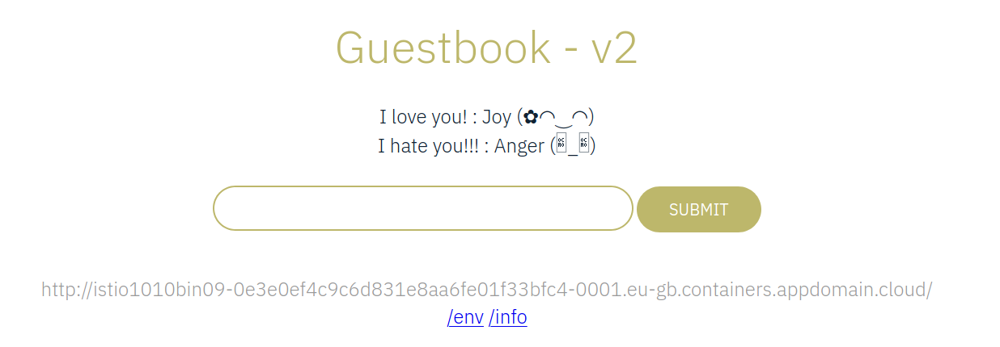
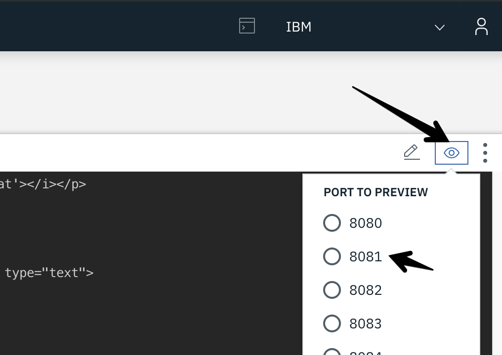
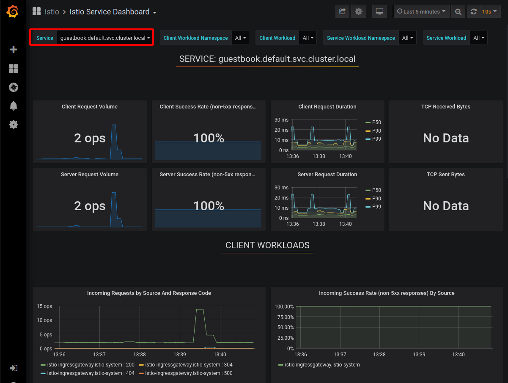
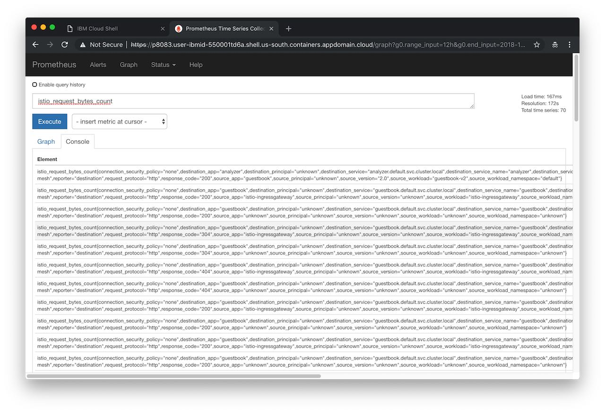

>[Getting Started - Prepare Your Environment](../README.md) ## 
[Exercise 1 - Accessing your Kubernetes Cluster](exercise-1/README.md) ##
[Exercise 2 - Installing Istio](exercise-2/README.md) ## 
[Exercise 3 - Deploy Guestbook with Istio Proxy](exercise-3/README.md) ## 
[Exercise 4 - Expose the service mesh with the Istio Ingress Gateway](exercise-4/README.md) ## 
**Exercise 5 - Telemetry** ## 
[Exercise 6 - Traffic Management](exercise-6/README.md) ## 
[Exercise 7 - Security](exercise-7/README.md)
---

# Exercise 5 - Observe service telemetry: metrics and tracing

### Challenges with microservices

We all know that microservice architecture is the perfect fit for cloud native applications and it increases the delivery velocities greatly. Envision you have many microservices that are delivered by multiple teams, how do you observe the the overall platform and each of the service to find out exactly what is going on with each of the services?  When something goes wrong, how do you know which service or which communication among the few services are causing the problem?

### Istio telemetry

Istio's tracing and metrics features are designed to provide broad and granular insight into the health of all services. Istio's role as a service mesh makes it the ideal data source for observability information, particularly in a microservices environment. As requests pass through multiple services, identifying performance bottlenecks becomes increasingly difficult using traditional debugging techniques. Distributed tracing provides a holistic view of requests transiting through multiple services, allowing for immediate identification of latency issues. With Istio, distributed tracing comes by default. This will expose latency, retry, and failure information for each hop in a request.

You can read more about how [Istio mixer enables telemetry reporting](https://istio.io/docs/concepts/policy-and-control/mixer.html).

### Configure Istio to receive telemetry data

1. Verify that the Grafana, Prometheus, Kiali and Jaeger add-ons were installed successfully. All add-ons are installed into the `istio-system` namespace.

    ```shell
    kubectl get pods -n istio-system
    kubectl get services -n istio-system
    ```

3. Obtain the guestbook endpoint to access the guestbook.

    The endpoint is the NLB host name ($NLB_HOSTNAME) from the previous lab. This is the command to list the address, watch out for the correct one, there should be two addresses:

    ```shell
    ibmcloud ks nlb-dnss --cluster $MYCLUSTER
    ```

    Go to this URL in the browser to try out your guestbook. This service will route you to either v1 or v2, at random. If you wish to see a different version, you'll need to do a hard refresh (`cmd + shift + r` on a mac, or `ctrl + f5` on a PC). Alternatively, you can `curl` the address.

    

1. Generate a small load to the app, replacing guestbook_IP with your own IP.

    ```shell
    for i in {1..20}; do sleep 0.5; curl http://$NLB_HOSTNAME/; done
    ```

## View guestbook telemetry data

In the previous lab we exposed the Istio Ingressgateway with the help of a Network Load Balancer (NLB) which gave us a URL ($NLB_HOSTNAME) to access the gestbook app. In this section we use the instructions provided on the Istio homepage to [remotely access the telemetry addons](https://istio.io/docs/tasks/observability/gateways/#option-2-insecure-access-http) like Grafana, Prometheus, and Kiali.

#### Grafana

<!--1. Establish port forwarding from local port 8082 to the Grafana instance:

    ```shell
    kubectl -n istio-system port-forward \
      $(kubectl -n istio-system get pod -l app=grafana -o jsonpath='{.items[0].metadata.name}') \
      8082:3000
    ```

2. Click on the web preview icon (an eye) and select port 8082.

    
-->

1. Make sure you are in directory '/istio101/workshop/plans', then expose Grafana:

    ```
    kubectl apply -f grafana-gateway.yaml
    ```

2. In your browser open the $NLB_HOSTNAME URL but add port 15031, e.g.:

    ```
    http://harald-uebele-ist-985933-5290c8c8e5797924dc1ad5d1b85b37c0-0001.eu-de.containers.appdomain.cloud:15031
    ```

3. Click on Home -> Istio -> Istio Service Dashboard.
4. Select guestbook in the Service drop down.
5. In a different tab, visit the guestbook application and refresh the page multiple times to generate some load.

    

This Grafana dashboard provides metrics for each workload. Explore the other dashboard provided as well.

<!-- 6. Use Ctrl-C in the cloudshell to exit the port-foward when you are done. -->

#### Prometheus

<!-- 1. Establish port forwarding from local port 8083 to the Prometheus pod.

    ```shell
    kubectl -n istio-system port-forward \
      $(kubectl -n istio-system get pod -l app=prometheus -o jsonpath='{.items[0].metadata.name}') \
      8083:9090
    ```
2. Click on the web preview icon and select port 8083, and i -->

1. Make sure you are in directory '/istio101/workshop/plans', then expose Prometheus:

    ```
    kubectl apply -f grafana-prometheus.yaml
    ```

2. In your browser open the $NLB_HOSTNAME URL but add port 15030, e.g.:

    ```
    http://harald-uebele-ist-985933-5290c8c8e5797924dc1ad5d1b85b37c0-0001.eu-de.containers.appdomain.cloud:15030
    ```

3. In the “Expression” input box, enter: `istio_request_bytes_count`. Click Execute.

3. Then try another query: `istio_requests_total{destination_service="guestbook.default.svc.cluster.local", destination_version="2.0"}`

    

4. Explore the Graph tab as well.

<!-- 5. Use Ctrl-C to exit the port-foward when you are done. -->

#### Kiali

Kiali is an open-source project that installs as an add-on on top of Istio to visualize your service mesh. It provides deeper insight into how your microservices interact with one another, and provides features such as circuit breakers and request rates for your services.

1. Create a secret which will be used to set the login credentials for Kiali (file can be found in /istio101/workshop/plans/)

    ```
    kubectl create -f kiali-secret.yaml
    ```

<!-- 1. Establish port forwarding to the Kiali pod from local port 8084.

    ```shell
    kubectl -n istio-system port-forward \
        $(kubectl -n istio-system get pod -l app=kiali -o jsonpath='{.items[0].metadata.name}') \
        8084:20001
    ```

2. Click on the web preview icon and select port 8084 to access the Kiali dashboard. --> 

2. Now expose Kiali:

    ```
    kubectl apply -f grafana-kiali.yaml
    ```

2. In your browser open the $NLB_HOSTNAME URL but add port 15029, e.g.:

    ```
    http://harald-uebele-ist-985933-5290c8c8e5797924dc1ad5d1b85b37c0-0001.eu-de.containers.appdomain.cloud:15029
    ```


2. Login with the following username/password: `admin/admin`.

4. Click the "Graph" tab on the left side and select the default namespace to see the a visual service graph of the various services in your Istio mesh. You can see request rates as well by clicking the "Edge Labels" tab and choosing "Traffic rate per second".

5. In a different tab, visit the guestbook application and refresh the page multiple times to generate some load.

Kiali has a number of views to help you visualize your services. Click through the various tabs to explore the service graph, and the various views for workloads, applications and services.

 

---

### [Continue to Exercise 6 - Traffic Management](../exercise-6/README.md)
